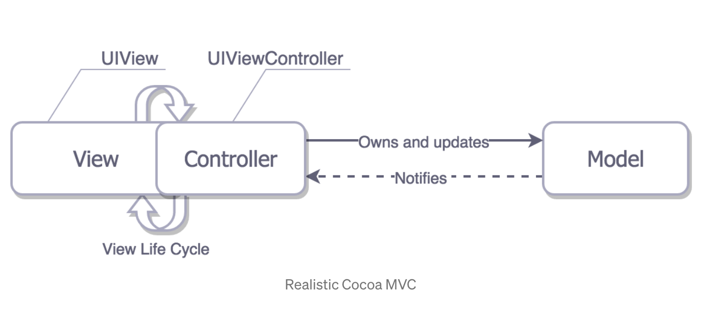
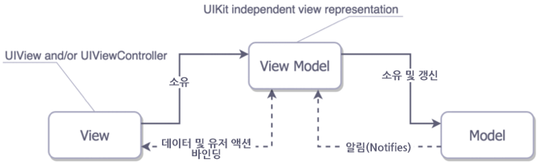
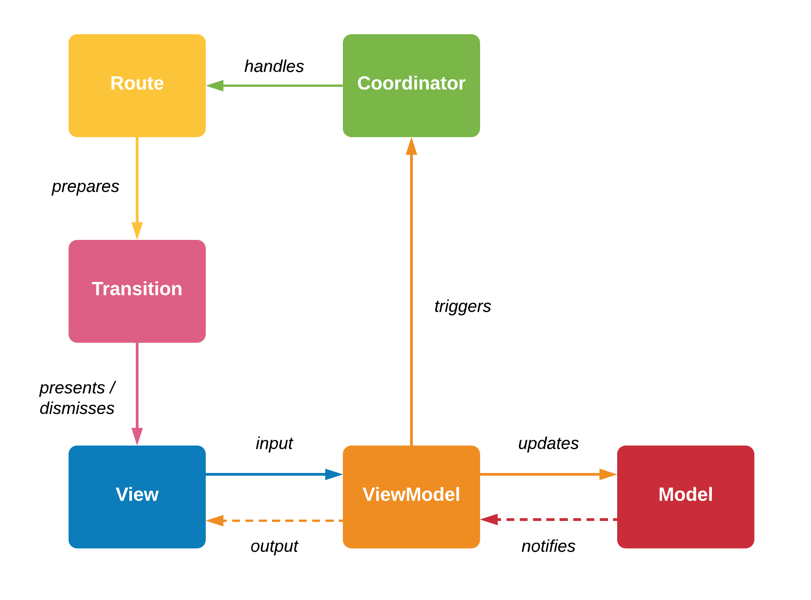
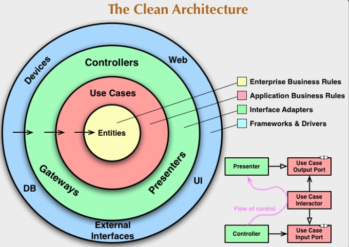
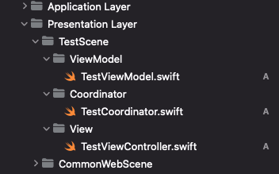

# [워크다이어리] 아키텍처(디자인 패턴) 채택

## 들어가며
먼저 기존 프로젝트와 다르게 아키텍처(디자인 패턴)에 대해 깊게 고민해보았다

대표적으로 iOS Application Architecture Patterns는 아래와 같이 여러 종류가 있다
* MVC
* MVP
* MVVM
* MVVM-C
* VIPER
* RIBS
  
여러 프로젝트를 진행하면서 다양한 패턴을 사용은 해봤지만,  이에 대해 정리한 글이 없어 향 후 자세한 글로 정리하면 좋을 것 같다

 

## 어떤 아키텍처를 선택할까

### 아키텍처의 목적 기준
* 담당자간 협업 효율 향상
* 코드의 안정성 향상
* 코드의 재사용 성 향상

여러 표현을 사용하지만 결과적으로 여러사람이 보더라도 유지보수가 용이하도록 하는것에 큰 목적을 두고 있는 것 같다

 

### 각 아키텍처의 장/단 점 기준 
* MVC
  * Model - View - Controller
  * 요약 
  * 
    * 가장 기본적인 형태의 디자인 패턴으로 Controller에 비즈니스 로직과 프레젠테이션 로직이 병합되어있다

  * 장점
    * 모든 작업을 controller 위주로 진행함에 따라 작업 속도만 놓고 볼 때 가장 빠르게 진행할 수 있다
    * 기능 별로 코드를 분리하여, 하나의 파일에 코드가 모이는 것을 방지할 수 있다

  * 단점
    * View와 Model 사이의 의존성이 높다
    * Controller가 매우 비대해짐에 따라 유지보수가 용이하지 않을 수 있다
    * ViewController 내 비즈니스 로직을 테스트 코드로 구현하기가 쉽지 않다
    * 구현 당시는 큰 문제가 되지 않을 수 있지만, 오랜만에 예전 프로젝트를 수정하는 경우 실제로 유지보수가 쉽지 않았다
    * 서비스가 복잡해지는 경우 의존성이 더욱 강해진다
  
 

* MVP
  * Model - View - Presenter
  * 요약
    * MVC 패턴과 유사하다
    * Controller 대신 Presenter가 존재한다
    * Presenter를 통해서만 데이터를 전달받는다

  * 장점
    * MVC 패턴의 단점인 View와 Model의 의존성이 해결될 수 있다

  * 단점
    * View와 Presenter간의 의존성은 해결되지 않는다
    * 서비스가 복잡해지는 경우 의존성이 더욱 강해진다
    
    
 

* MVVM
  * Model - View - ViewModel
  * 요약
  * 
    * 현재 가장 많이 채택하고 있는 디자인 패턴
    * View는 ViewModel에 의존하여 가공된 데이터를 보여주는 역할만을 수행한다
    * ViewMdoel내에 비즈니스 로직이 들어간다
    * controller는 View 에 포함된다
    * View는 ViewModel내 Model을 데이터 바인딩하여 비동기적으로 화면을 그린다
    * View Model과 View의 관계는 1:N이다

  * 장점
    * 비즈니스로직과 View 로직이 분리되어있어 테스트코드 작성이 보다 용이하다
    * ViewModel의 분리를 통해 비즈니스로직의 재사용성이 증가한다
    * RxSwift와 같은 반응형 프로그래밍과 궁합이 잘 맞을 수 있다
    * View와 ViewModel간 의존성이 줄어들어 유지보수가 용이하다

  * 단점
    * 여러 파일과 설계 과정이 지속되어야 함에 따라 MVC에 비해 생산성이 떨어질 수 있다
    * 데이터의 바인딩과 UI가 반응하는 시점에 따라 잘못된 동작이 일어나거나 순환참조로 인해 메모리 누수가 일어날 수 있다

 

* MVVM-C
  * Model - View - ViewModel - Coordinator
  * 요약
  * 
    * MVVM과 동일하나 화면 전환 역할을 Coordinator로 이관한다

  * 장점
    * ViewModel이 View에 대한 정보를 아예 모를 수 있다 (`import UIKit` 이 필요없다)
    * Coordinator를 통해 유연한 화면전환이 가능하다

  * 단점
    * 하나의 Scene 을 구현할 때 기본적으로 4개의 파일을 생성해야한다
    * 초기 설계과정이 중요하여 생산성이 떨어질 수 있다

 

* VIPER
  * View - Interactor - Presenter - Entity - Router
  * 요약
  * ](./images/viper.png)
    * View : Presenter가 보여주는 걸 보여주며, 사용자의 액션을 Presneter로 보내는 작업을 한다.
    * Interactor : Business logic을 포함하며, API나 DB로 부터 Data를 받아서 Entity(모델)을 생성한다.
    * Presenter : View에서 유저의 액션을 받고, Interactor에 data를 요청하고 받아서 View 에 그려준다.
    * Entity : Interactor에 의해 만들어지는 Model 이다.
    * Router : Navigation logic 을 담당하고 있으며, screen에서 다른  screen으로 화면이 변경되는 부분을 처리한다.
    
  * 장점
    * 각 도메인의 역할이 명확히 구분될 수있다
    * 모듈을 작게 만들고 역할을 분명히 하기에 대규모 프로젝트에 사용되기 용이하다

  * 단점
    * 설계가 여러 곳으로 난립될 수 있다 
    * 명확한 가이드나 유지보수가 이루어지고 있는 곳이 드물다
    * 하나의 Scene 을 구현할 때 많은 파일들을 생성해야 한다
    * 앱의 상태가 View에 의해 구동되는 View Driven Logic으로 비즈니스 로직만 있는 VIPER노드 구현에 어려움이 있다

* RIBS
  * Router - Interactor - Builder
  * 요약
  * ](./images/ribs1.png)
    * Builder : RIBs의 모든 구성요소를 생성하고 DI를 정의한다.
      > 즉, Router, Interactor, View, Component를 모두 생성한다

    * Component : 부모 RIB Builder가 Component를 통해 자식 RIB Builder로 의존성을 주입시킨다
    * Router : 자식 RIB를 attach, detach하여 RIBs 논리적 트리 구조를 형성한다
    * Interactor
      > 비즈니스 로직을 수행하여 Router로 Routing call 그리고 RIBs의 attach와 detach를 요청한다 
      Presenter로 Data model를 전달한다.
    * View : UI화면을 생성하고 구성한다
      > UI Event를 Presenter로 전달한다  
      View model을 받아서 UI를 업데이트한다
    * Presenter : Interactor와 View간의 통신을 담당하여 Business model을 View model로 변환하는 역할로 상태를 가지고 있지 않은 클래스다
      > Presenter를 생략하는 경우 View model 변환의 책임은 View 또는 Interactor가 되어야 한다. 
      필요에 따라 Presenter와 View가 구성된다의 의미는,   
      VIPER 패턴과 달리 View가 포함되지 않고 비즈니스 로직으로만 구성된 Viewless RIB의 생성이 가능하다.

  * 장점
    * 의존성이 매우 적다
    * iOS와 안드로이드가 동일한 설계가 가능하다고 한다
    * 기능 별 테스트 코드 작성이 용이하다
    * POP 프로그래밍의 규칙을 따른다
    * 다른 RIB의 Interactor에 접근이 쉬집 않기 때문에 독립적인 설계를 하도록 유도된다

  * 단점
    * 각 프로토콜의 의미를 모두 파악해야한다
    * 엄청나게 많은 파일을 생성해야한다.
      * 우버에서 템플릿으로 제공하고 있으나, 프로토콜 정의의 변경이 일어나면 모든 클래스에 영향을 준다
    * 의존성 주입이 각각의 RIB에 필요하고 Swinject로 대안할 수 있다

 

## 선택은?
* 모두 장/단점이 있으나 후보군은 두가지로 정리되었다

1. MVVM-C
2. RIBS

 

### Discussion
* RIBS의 경우 파일이 너무 많아지고 러닝커브가 있다
* RIBS의 역할 분리를 대안할 수 있는 방법으로는 Layering 이 있다
  * 클린아키텍처에 MVVM-C를 도입하는 방향은 어떨까

* Clean Architecture

 

### Conclusion
* 결과적으로 조금 더 익숙하고 생산성이 빠르게 나올 수 있는 Clean Architecture + MVVM-C 를 도입하게 되었다
* 이 과정에서 단점으로 꼽히는것은 결국 Scene 생성에 대한 불편함이었는데  
  이는 스크립트로 해소하기로 했다
* 개인적으로 진행하는 프로젝트는 아래 스크립트를 항상 사용하고 있다
* [Scene generate](./scripts/gen_scene.sh)
* 기능을 간단히 요약하면 아래와 같다
  1. 해당 프로젝트의 ROOT Directory로 이동한다
  2. `GenerateScene` 이라는 폴더로 임시 폴더를 생성한다
  3. `.gitignore` 에 해당 해당 폴더를 추가한다
  4. 사용자로부터 생성한 `Scene`이름을 입력받는다 `eg. SignUp`
  5. 입력받은 `Scene` 이름으로 폴더를 생성한다 `eg. SignUpScene`
  6. 입력받은 `Scene` 이름을 기준하여 아래와 같은 파일과 내용을 생성한다
     1. ViewModel
     2. ViewController
     3. Coordinator
 

  7. 프로젝트의 `Presentation Layer` 하위로 생성된 폴더를 끌어넣는다

* (스크립트를 잘 다루지 못해서 수동으로 일일히 작성한게 조금 아쉽다)

* 클린 아키텍처 도입을 통해 얻을 수 있는 효과는 아래와 같았다
  * 각 Scene 별 레이어를 확실하게 구분할 수 있다
  * protocol 선언으로 의존성을 주입하여 각 레이어에서 안쪽으로만 향할 수 있도록 구조화 할 수 있다
  * Usecase와 Service를 Protocol화 하여 테스트 코드 작성 시 Mocking 이 수월해진다
  * 네트워킹에 사용되는 Entity(DTO)와 실제 앱에서 사용 할 Entity를 Layer기준으로 명확히 구분할 수 있다

* 개인적으로 구현한 프레임워크 예제 앱에도 반영해 보았습니다 ([참고](https://github.com/vincent-k-sm/MKFoundation/tree/master/MKFoundationExample)])
    

## 마치며
과연 이게 적절한 아키텍쳐 및 디자인 패턴인지는 알 수 없는 것 같다

다만, 디자인 패턴들은 기존의 단점을 개선하고자 지속적으로 고민하고 구현해야 하며 언제든지 새로운 것을 받아들일 준비하는 것을 항상 마음에 담아두고 있어야 할 것 같다

실무에서는 여러 담당자와 더욱 많은 협업이 이루어질테니 이런 요소 하나하나를 고민하고 같이 논의해보는 자리가 생기면 좋지 않을까?

