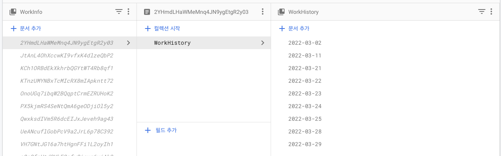
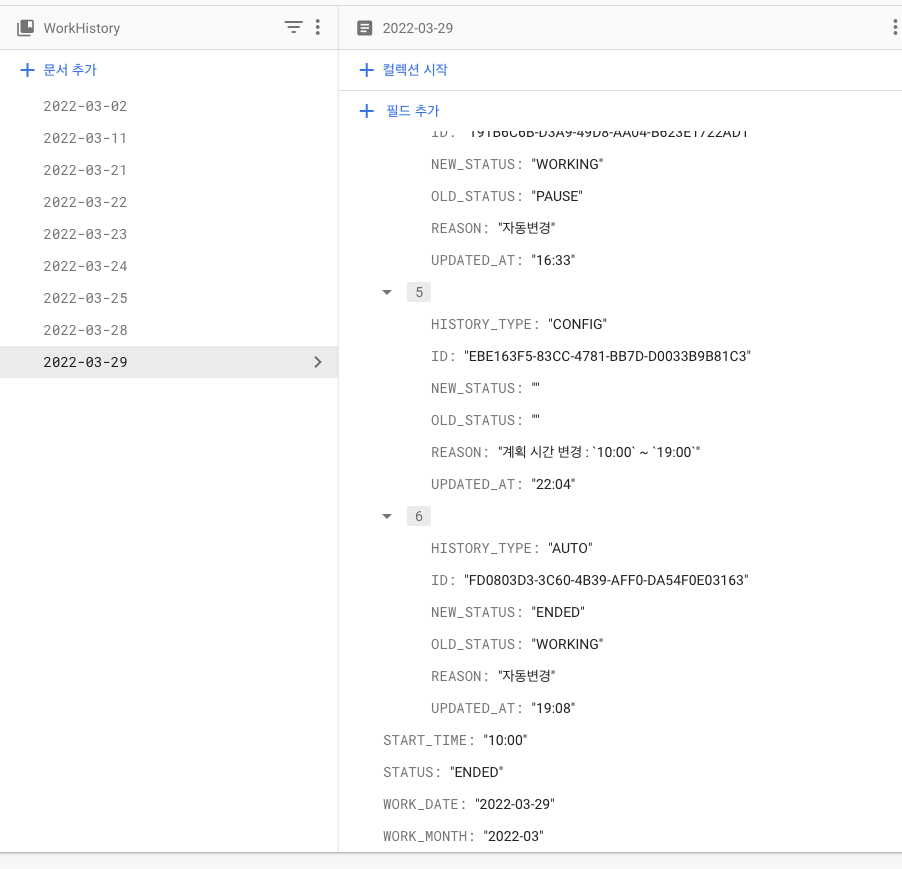

# [워크다이어리] Python vs Firestore(Firebase)

## 들어가며
이번 프로젝트는 데이터베이스가 필요하고 각 유저가 여러 디바이스에서 접근할 수 있는 구조를 감안하였다, 

예를들어 웹 페이지 또는 안드로이드에서도 사용할 수 있도록 하고자 했는데<br>
이 때 채택할 수 있는 선택지는 python(Django)를 활용하거나 Firebase에서 제공하는 Firestore을 선택할 수 있었다

이를 선택하는 과정에 대해 기록하고자한다

<br>

## 먼저 분석해보자! (장단점 비교)
먼저 각 선택지에 대한 장 / 단점을 정리해본다

* python
  * 장점
    * 데이터가공 및 계산을 클라이언트에 의존하지 않고 백엔드에서 처리하여 클라이언트가 가벼워질 수 있다
    * 원하는 형태의 response를 제공하여 편리하게 작업할 수 있다
    * 관련 로그 수집이 용이하다
    * 콘솔을 통해 전체 데이터 확인이 용이하다
    
  * 단점
    * 개인 서버 (synology)를 사용하지 않으면 고정비용이 발생한다
    * Django와 ORM 을 활용하여 구현할 수 있으나, 이해도와 관련 지식레벨이 얕다
    * 유지보수를 위해 지속적으로 신경써야한다 (정전 등에 대한 대응이 어렵다)
    * 서버이슈 발생 시 대응이 용이하지 않다


* Firestore
  * 장점
    * 초기 비용이 발생하지 않는다
    * Firebase에서 제공함에 따라 비교적 안정성이 높다
    * 회원 가입 및 인증에 대한 과정이 통합될 수 있다
    * Crashlytics 및 Log 수집 플랫폼을 단일화 할 수 있다
  * 단점
    * function을 사용하지 않으면 모든 데이터 가공과 CRUD행위를 클라이언트에서 담당해야 한다
      * 유료 플랜을 사용하지않으면 JavaScript based 함수처리를 할 수 없다
      * Firestore은 API 형태로 사용되지 않는다
    * 데이터를 UPDATE 하기 위해 완성된 데이터를 클라이언트에서 보내야하며, response에 결과 값이 없다


<br>

## Conclusion
아무래도 서비스의 안정성을 버릴 수 없다고 판단하여 Firestore를 채택하게 되었다.

## ISSUE & Discussion
Firestore를 연동하면서 발생한 설계 상 고민 포인트와 어려웠던 부분을 정리한다
  
## Firestore는 NOSQL 형태로 모든 데이터가 Document & Collection Tree를 가지고 있어 구조 설계가 어려웠다
> 각 회원에 대한 고유 ID`(Authenication)`를 기준으로 컬렉션을 만들고 Static하게 사용해야 하는 설정값을 저장한다<br>
> 또한 매 일 00시를 기준하여 하루치의 `document`를 생성하여 관리한다 <br>
> `Document` 에 접근할 때마다 사용량이 증가함에 따른 부가적인 이슈는 아래와 같이 대응했다
  


### 사용량에 따라 무료 할당량을 초과하면 비용이 발생한다
* 서비스가 커지면.. (행복회로) 어쩔 수 없는 부분이나 직접 백엔드를 구현했다면 쉽게 해결 될 요소였던 것 같다.
* 일례로 메인 화면에 진입하게 되면 제공되는 데이터는 `주간 데이터`, `오늘 데이터`, `월간데이터` 를 모두가져와야 했다
  * 이 때 해당 화면이 `ViewDid/WillAppear`되면 각 각 호출하는게 맞을 수 있지만, <br>
  이번에는 최초 Load 시점에 월간데이터를 가져오고, 이를 내부 `WorkInfoManager`에 통합하여 관리하도록 처리했다.
  ```swift
  typealias WorkInfoManagerWorkInfosBlock = ([WorkStatusInfo]) -> Void
  typealias WorkInfoManagerSuccess = (Bool) -> Void
  typealias WorkInfoManagerFailure = (Error) -> Void

  final class WorkInfoManager {
    static let shared = WorkInfoManager()
    let networkService: FirebaseWorkNetworkService!
    
    private var cancelables: Set<AnyCancellable> = []
    
    // MARK: Properties
    private(set) var workStatusInfos: [String: [WorkStatusInfo]] = [:]
    
    deinit {
      ...
    }
  }
  ```
  > 여기서 `workStatusInfo`는 월간데이터(캘린더)의 이전 / 다음 월로 넘길 때 조금 더 빠르게 데이터를 가져오기 위해 Dictionary 형태로 사용했다

* 이 후 네트워킹 이 후 변경사항에 대해 각 항목을 업데이트 하도록 처리하여 모든 화면에 동일하게 반영될 수 있도록 처리했다
  ```swift
  func updateWorkInfo(info: WorkStatusInfo) {
      let workMonth = info.workMonth
      info.updateIsNotEnded()
      if let currentWorkMonth = self.workStatusInfos[workMonth],
          let firstIndex = currentWorkMonth.firstIndex(where: { $0.workDate == info.workDate }) {
          self.workStatusInfos[workMonth]?[firstIndex] = info
  
      }
      else {
          self.workStatusInfos[workMonth]?.append(info)
      }
      
      self.refreshEvent.send() // refresh Trigger로 탭바 내 관련 데이터를 갱신하도록 한다
  }
  ```


### Firestore의 CRUD과정에서 결과 값을 주지 않는다
* 이 부분이 가장 어려웠는데 `document`를 업데이트하면 모두 덮어씌워지도록 처리가 되었다,<br>
`merge` 옵션을 사용하면 기존 데이터는 유지된 채로 새로 적용한 값만 업데이트 될 수 있으나,<br> 결과값이 없어 결국 시간 계산등의 처리를 위해 기존 데이터를 계속 알고 있어야 하는 이슈가 있었다
* 예를 들면 변경된 근무 상태가 `종료` 인 경우 기존 데이터의 근무 종료 시간필드를 업데이트하고 근무 내역(history)도 갱신 해야하는데,<br>
별도의 response가 없어 기존 Object 전체를 Usecase로 넘기고 return에 해당 내용을 포함하도록 처리했다

아래는 근무 상태 변경에 대한 UseCase의 일부이다

이 때 꼭 필요한 경우 Document를 다시 조회하는 대안도 사용할 수 있으나, <br>
Firestore 사용량에 따라 무료로 할당된 범위가 있어 최대한 *지양* 하였다
```swift
/* FirebaseWorkNetworkService */
  func setWorkStatus(
      userInfo: User,
      workHistory: [WorkHistoryRawModel],
      newBreakTime: String?
  ) -> AnyPublisher<WorkStatusInfo, ApiErrorMessage>
```
```swift
/* FirebaseWorkNetworkUseCase */
extension FirebaseWorkNetworkUseCase {
    func setWorkStatus(
        userInfo: User,
        workHistory: [WorkHistoryRawModel],
        newBreakTime: String? = nil
    ) -> AnyPublisher<WorkStatusInfo, ApiErrorMessage> {
        
        let db = Firestore.firestore()

        let collection = db
            .collection(FirebaseWorkNetworkUseCase.Collections.workInfo)
            .document(userInfo.uid)
        
        let today = Date().string(withFormat: "yyyy-MM-dd")
        let newDoc = collection.collection(FirebaseWorkNetworkUseCase.Collections.workHistory)
            .document(today)
        
        var newData: [String: Any] = [:]
        if let newHistory = workHistory.last {
            
            newData[WorkStatusInfoDTO.CodingKeys.status.rawValue] = newHistory.newStatus.rawValue
            
            if newHistory.oldStatus == .prepare {
                let time = Date().string(withFormat: "HH:mm")
                newData[WorkStatusInfoDTO.CodingKeys.actualStartTime.rawValue] = time
            }
            
            if newHistory.newStatus == .ended {
                let time = Date().string(withFormat: "HH:mm")
                newData[WorkStatusInfoDTO.CodingKeys.actualEndTime.rawValue] = time
            }
        }
        
        let workHistoryDto: [[String: Any]] = workHistory.map { el -> [String: Any] in
            return WorkHistoryRawDTO.toDict(from: el)
        }
        newData[WorkStatusInfoDTO.CodingKeys.history.rawValue] = workHistoryDto
        
        if let newBreakTime = newBreakTime {
            newData[WorkStatusInfoDTO.CodingKeys.breakTime.rawValue] = newBreakTime
        }

        return Future<WorkStatusInfo, ApiErrorMessage> { promise in
            DispatchQueue.main.async {
                ProgressView.shared.show()
            }
            
            newDoc.setData(newData, merge: true, completion: { error in
                DispatchQueue.main.async {
                    ProgressView.shared.dismiss()
                }

                if let error = error {
                    let errMsg = ApiErrorMessage(error: error.localizedDescription)
                    promise(.failure(errMsg))
                }
                else {
                    newDoc.getDocument(completion: { snapshot, error in
                        DispatchQueue.main.async {
                            ProgressView.shared.dismiss()
                        }
                        if let error = error {
                            let errMsg = ApiErrorMessage(error: error.localizedDescription)
                            promise(.failure(errMsg))
                            return
                        }

                        if let snapshot = snapshot {
                            let result = self.decodeWorkStatusDTO(snapshot: snapshot)
                            if let error = result.error {
                                promise(.failure(error))
                            }

                            if let value = result.result {
                                promise(.success(value))
                            }
                        }

                    })
                    
                }
                
            })

        }
        .eraseToAnyPublisher()
    }
    
```


### Select 시 `JOIN`에 대한 개념이 없다
* `색인` 을 사용하면 목적과 유사하게 동작할 수 있으나, 잘못된 색인으로 이슈를 야기하기보다 <br> 데이터 내 실제로 참조할 값을 최대한 많이 적용하는 방법으로 수립했다<br>
아래 예시는 Document ID가 날짜로 선언되어있지만, <br>Select할 때 특정 document ID 를 기준으로 가져올 수 없음에 따라 document내에 날짜정보를 추가로 작성하였다


상기 설계를 통해 아래와 같은 호출이 가능하다
> eg. 접속한 날짜를 기준으로 월~일요일까지 주간 데이터를 가져오는 기능
```swift
extension FirebaseWorkNetworkUseCase {
    func getWeekWorkInfo(userInfo: User, as date: Date = Date()) -> AnyPublisher<[WorkStatusInfo], ApiErrorMessage> {
        
        let db = Firestore.firestore()
        
        let collection = db
            .collection(FirebaseWorkNetworkUseCase.Collections.workInfo)
            .document(userInfo.uid)
        
        let calendar = Calendar.current
        let thisWeekDays: [String] = calendar.daysWithSameWeekOfYear(as: date)
                                              .map({ $0.string(withFormat: "yyyy-MM-dd") })
        
        return Future<[WorkStatusInfo], ApiErrorMessage> { promise in
          
            collection.collection(FirebaseWorkNetworkUseCase.Collections.workHistory)
                .whereField(WorkStatusInfoDTO.CodingKeys.workDate.rawValue, in: thisWeekDays)
                .getDocuments(completion: { snapshot, error in

                    if let error = error {
                        let apiErrorMessage: ApiErrorMessage
                        apiErrorMessage = ApiErrorMessage(error: error.localizedDescription)
                        promise(.failure(apiErrorMessage))
                    }
                    else if let snapshot = snapshot {
                        
                        let docs = snapshot.documents
                        var result: [WorkStatusInfo] = []
                        result = docs.map { doc -> WorkStatusInfo in
                            let result = self.decodeWorkStatusDTO(snapshot: doc)
                            var v = WorkStatusInfo()
                            if let error = result.error {
                                Debug.print(error.localizedDescription)
                                
                            }
                            if let result = result.result {
                                v = result
                            }
                            
                            return v
                        }
                        promise(.success(result))
                        
                    }
                    else {
                        let apiErrorMessage: ApiErrorMessage
                        apiErrorMessage = ApiErrorMessage(error: FirestoreError.nilResultError.localizedDescription)
                        promise(.failure(apiErrorMessage))
                    }
                    
                })
            
        }
        .eraseToAnyPublisher()
    }
}
```
## 마치며..
* 클라이언트 로직이 매우 복잡해졌지만 나름 합리적인 구조로 설계된 것 같다
  * 위 방법들을 통해 최종적으로 네트워킹 flow를 최소한으로 줄여 처리하였으나, <br> 개인적으로 다음 프로젝트를 할 때는 조금더 sync가 잘 맞을 수 있도록<br>백엔드를 직접 구현하는 방향으로 가지않을까 예상한다..
  * 모든 데이터 정합성을 클라이언트가 하니 클라이언트가 수행하는 역할이 너무 비대해지는 것 같다
*  향 후 Firestore 연동 및 초기 세팅에 대한 가이드를 작성해보아야겠다