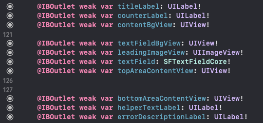

# [워크다이어리] UI Component 모듈화 하기

## 들어가며
벌써 개인 프로젝트로 4번째 앱을 구현하다보니 `Sketch` 나 `View`에서 사용하는 리소스와 전반적인 레이아웃이 동일하게 반복되는게 느껴졌다.

예전부터 생각했던 UI 관련 사항을 Component화 하여 여러곳에 재사용하는 작업을 시도해봤다


<br>

## 기능 선정
생각한 컴포넌트는 아래와 같다
1. 버튼
2. 색상 (darkmode가 지원되도록한다)
3. TextView (테이블뷰에서 작성길이에 따라 자동으로 높이도 조절되도록 한다)
4. Textfield
5. Selectbox
6. Switch
7. CheckBox

<br>

## 기술 검토 & Conclusion
SPM(`Swift Package Manager`) 으로 채택! <br>
이 전 직장에서 `Cocoa Pod` 로 프레임워크화 작업을 해본적이 있으니 이번에는 SPM으로 작업하기로 했다

<br>

## 구현과정
사실 이 작업을 시작할때까지만 해도 `xib`를 활용한 UI 구현이 익숙했고 <br>
메인 프로젝트 외 부가적인 영역이라 생각되어 가벼운 마음으로 `xib`로 구현을 시작했다

그러나 어느정도 구현 후 적용하는 과정에서 치명적인 요소가 발생했는데, <br>
xib로 구현한 Textfield를 확장해서 사용해야 하는 경우였다

<br>

### xib로 구현했을 때 문제점
xib로 구현시에는 컴포넌트를 `public class` 로 구현했다<br>
이 경우에도 단순히 정적인 UI 배치에는 문제가 없었는데, <br>
textfield 에 커스텀 Toolbar를 적용하는데에 이슈가 발생했다.<br>

물론 Component 내 공통으로 적용하고 optional하게 사용하고 싶었으나, 활용도가 높지 않을 것 같아<br>
확장해서 custom view를 추가하려 했으나, 애초에 `public`은 정의 모듈 외부에서 `subclassing`이 불가능 했고<br>
추가로 `xib`안에 있는 `@IBOutlet`의 UI를 재정의할 수는 없었다
> 이 부분은 수정작업할 때 원인을 잘 적어놨어야 하는데 왜 안되는지는 차 후 다시 검토 해봐야겠다 ㅠㅠ..

<br>

### xib에서 codebased으로
사실 처음이 과정에서 Snapkit을 Dependency로 설정하고 내부에서 사용해버릴까 고민도 했지만,<br>
Snapkit 버전이나 환경은 계속 업데이트 될 것으로 보여 오랜만에 기본으로 작업하게 되었다

AS-IS



TO-BE
```swift
self.tfStackView.translatesAutoresizingMaskIntoConstraints = false
let tfStackViewConstraints = [
    tfStackView.topAnchor.constraint(equalTo: tfStackView.superview!.topAnchor, constant: 0),
    tfStackView.leftAnchor.constraint(equalTo: tfStackView.superview!.leftAnchor, constant: 16),
    tfStackView.rightAnchor.constraint(equalTo: tfStackView.superview!.rightAnchor, constant: -16),
    tfStackView.bottomAnchor.constraint(equalTo: tfStackView.superview!.bottomAnchor, constant: 0)
]
NSLayoutConstraint.activate(tfStackViewConstraints)

```

## 마치며
결과적으로 UI Component화는 큰 이슈없이 마무리되었다<br>
목표 했던대로 최대한 Subclassing도 가능하고 확장된 기능도 적절히 사용할 수 있었다
```swift
class CustomMKTextView: MKTextView {
    
    private var taggedAttributes: [NSAttributedString.Key: Any] = {
        return [NSAttributedString.Key.underlineStyle: NSUnderlineStyle.single.rawValue]
        
    }()
    private var isTyping: Bool = false
    override var text: String {
        get {
            return super.text
        }
        set {
            super.text = newValue
            tagging()

        }
    }
  ...

  extension CustomMKTextView {
    private func tagging() {

        let selectedRange = self.textView.selectedRange
        
        let attributedString = NSMutableAttributedString(string: textView.text)
        var defaultAttrs = self.textView.typingAttributes
        defaultAttrs.removeValue(forKey: .underlineStyle)
        defaultAttrs.removeValue(forKey: .link)
        attributedString.addAttributes(defaultAttrs, range: NSRange(location: 0, length: textView.text.utf16.count))

        do {

            let leftOverrideString = SlackRegexTypes.leftOverrideString
            let regexString = "\(leftOverrideString)(.*?)\(leftOverrideString)"
            let regex = try NSRegularExpression(pattern: regexString, options: [])

            let matches = regex.matches(in: text, options: [], range: NSRange(location: 0, length: text.count))

            for match in matches {
                let rangeBetweenQuotes = match.range(at: 0)
                attributedString.addAttribute(.link, value: UIColor.systemBackground, range: rangeBetweenQuotes)
                attributedString.addAttributes(taggedAttributes, range: rangeBetweenQuotes)
                
            }
            self.attributedText = attributedString
            self.textView.selectedRange = selectedRange
            
        }
        catch let error {
            Debug.print(error)
        }
        
    }
}

}
```

## 비고
> 전체 코드는 [github-MKFoundation](https://github.com/vincent-k-sm/MKFoundation)에서 확인할 수 있습니다<br>

* [예제 영상](https://user-images.githubusercontent.com/24787667/160271811-543a406e-3a2a-4d1a-b076-6c4bbb37d81a.mov)